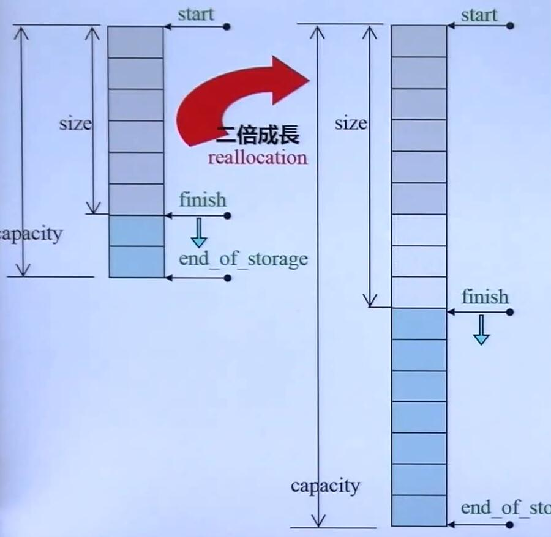

# STL 内核

## vector

* vector 事实上可以看成一个能够自动扩容的，自动进行内存管理，提供STL接口的数组。
* vector在内存中是连续空间存放，因此其指针(迭代器)可以做到随机访问



GC2.9

```c++
template<class T, class Alloc = alloc>
class vector{
    public:
        typedef T   value_type;
        typedef value_type* iterator; // T*
        // 这里迭代器类型就是普通的指针，non-class iterator
        typedef value_type& reference;
        typedef size_t  size_type;
    protected:
        iterator start;
        iterator finish;
        iterator end_of_storage;
    public:
        // begin和end是前闭后开区间
        iterator begin(){return start;}
        ietrator end(){return finish;}
        size_type size() const
        {return size_type(end()-begin());}
        size_type capacity()const
        {return size_type(end_of_storage-begin());}
        bool empty() const {return begin() ==end();}
        reference operator[](size_type n)
        {return *(begin()+n);}
        reference front() {return *begin();}
        reference back(){return *(end()-1);}
}

// push_back
void push_back(const T&x){
    if(finish != end_of_storage){ //还有备用空间
        construct(finish,x); //全局函数
        ++finish; //指针下移动 
    }
}else{
    //没有备用空间了
    insert_aux(end(),x);
}

template<class T,class Alloc>
void vector<T,Alloc>::insert_aux(iterator position, const T& x)
{
    if(finish !=end_of_storage){
        //还有备用空间
        //在备用空间(finish指针下一个空的空间)
        /*
        这里这个地方这么些，是因为 insert_aux还可能被 insert函数
        调用，所有有一个把所有的元素
        往后搬的操作
        */
        construct(finish,*(finish-1));
        ++finish;
        T x_copy = x;
        copy_backward(position,finish-2,finish-1); 
        // 个人推测这里就是把position之后的元素往后搬一格
        //腾出 position的位置,这个函数应该是insert的实现。
        *position = x_copy;
    }else{
        //如果空间不够，vector需要进行扩容
        const size_type old_size = size();
        const size_type len = old_size !=0 ? 2*old_size : 1;
        // 以上的分配原则如果大小是0设为1
        //如果原大小不为0，分配为原大小的2倍
        //前半段用来放置旧的数据后半段放新数据
        //扩容的标准，不同编译器实现不同
        iterator new_start = data_allocator::allocate(len);// realloc
        iterator new_finish = new_start;
        try{
            new_finish = uninitialized_copy(start,position,new_start);
            //前闭后开把 [start,position)的元素，也就是前半段元素进行复制
            construct(new_finish,x);//将x填充到position位置
            ++new_finish;
            //复制原vector,的[position,end)的内容
            new_finish = uninitialized_copy(position,finish,new_finish);

            //这里为什么会复制前半段，和后半段？
            //如前所述，这个函数可能被insert调用的
            //其实push_back可以看成insert的特殊形式。
            //push_back(value)等价于insert(end(),value)
        }catch(...){
            destory(new_start,new_finish);
            data_allocator::deallocate)new_start,len);
            throw;
        }
        //析构并释放原来的vector
        destory(begin(),end());
        deallocate();
        //调整迭代器
        start = new_start;
        finish = new_finish;
        end_of_storage = new_start +len;
        //对于前闭后开区间，区间长度等于end-start。
    }
}
```

* 上述代码为GC2.9的实现，使用老版本的代码，是因为其实现比较简单，更能够让我们从中体会容器的原理，新版的代码使用了很多多重继承，代码不容易阅读
* 从vector的设计代码，我们可以知道，vector的扩容的代价是很大的，因为它要不断调用复制构造函数。
* 在使用vector的时候，一开始就指定一个合适的容量大小，减少其扩容的次数，显然对提升效率很有帮助(使用 `reverse`函数)
* 在C++11之后，可以通过move语义来减少上述开销
* vector的insert操作的复杂度应该是**O(n)**,因为插入一个元素，要搬动后面的元素，所以要减少在数组前进行insert操作，同时insert操作也有可能会诱发vector扩容。

## array

Array 和 内置的数组本质上没有区别，Array是对内置数组的包装，包装之后的array提供和其它容器一样的公共接口(比如 iterator)，这样array就可以使用算法，仿函数等其它标准库的部件了。


TR1版本的 array实现

```c++
template<typename _Tp, std::size_t _Nm>
struct array
{
    typedef _Tp value_type;
    typedef _Tp*  pointer;
    typedef value_type* iterator; 
    // array的迭代器类型就是 T* 是 non-class vector

    // support for zero-sized arrays mandatory
    value_type _M_instance[_Nm ? _Nm :1];
    iterator begin()
    {return iterator (&_M_instance[0]);}
    iterator end()
    {return iterator(&_M_instance[_Nm]);}
    ...
}

```

## forward_list  

forward_list就是单链表。因为forward_list是单链表，所以forward_list缺少很多接口，比如只有 `front` ,比如是在一个节点之后进行插入。这都和其单链表的特性相关。可以再看看forward_list的接口好好体会一下. 因为已经说了双链表list了所以forward_list不再缀述


 
## rb_tree

Red-Black tree(红黑树)是平衡二叉搜索树 