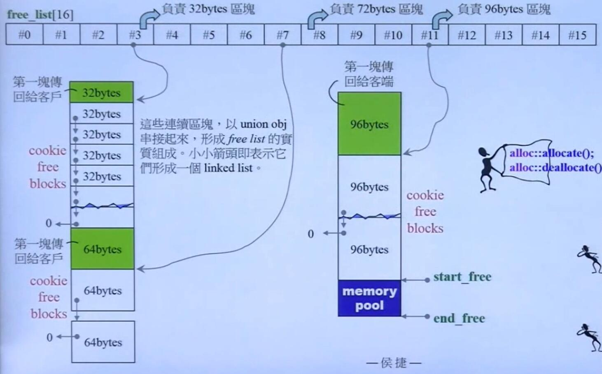
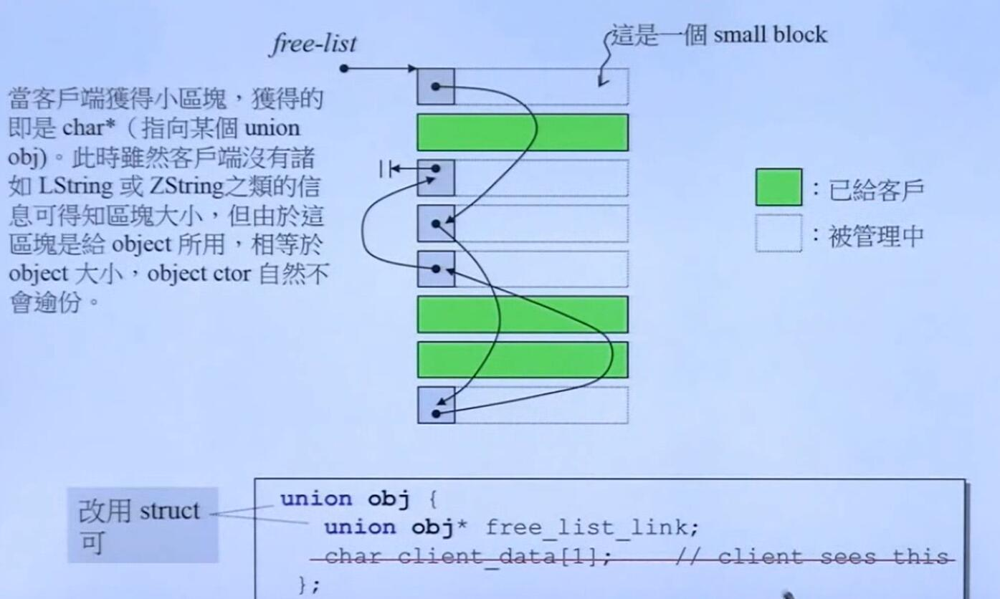
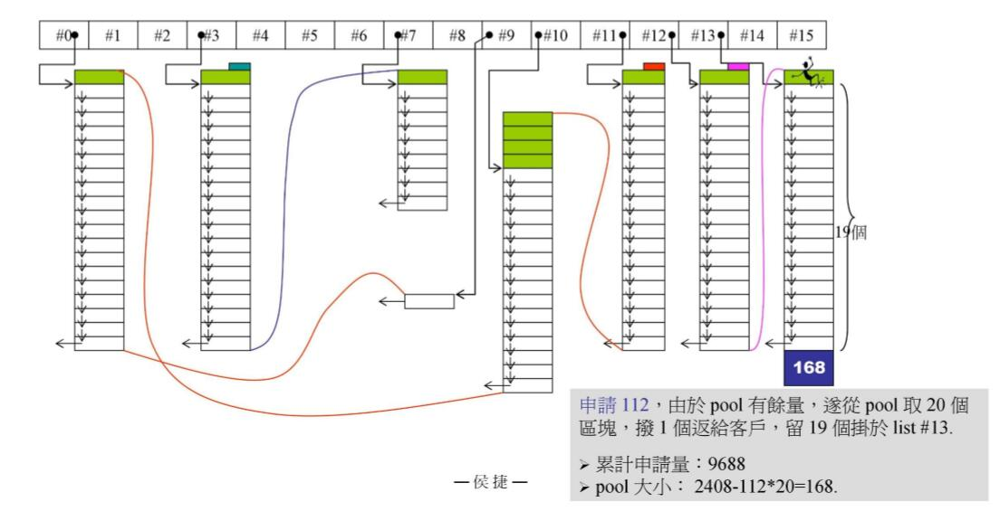

# C++内存管理

## G2.9 std::alloc



* 分配出去的内存都是 8 的倍数，比如如果是 6 那么会分配8
* alloc 负责的内存范围是 8-128 bytes(二级分配器) ,如果 超出 128 B, 就调用 malloc(一级分配器)
* 每一个大小下面挂着一个链表，链表采用的是内嵌指针(之前的简单 allocator实现过 embedded pointer)。
  

* 第一次分配一般会用 malloc 拿 20 块的空间(20 可能是经验)分给相应的size,同时拿20块的空间作为后备池(等到下次有新的请求的时候直接分给它不需要再调用 malloc), 也就是说一次拿 40块
* std::alloc 有一个重要的概念就是后备池，后备池的内存不属于任何一条链表，当有新的allocate需求并且freelist里不能提供需求的时候，会从后备池中拿内存。
* 当从后备池中拿内存的时候，最多一次拿 20 块资源，当不足20块的时候，能给多少给多少，如果一块都给不了，alloc会把后备池中的内存碎片接到freelist合适的位置上(内存碎片处理),然后用malloc重新申请内存，重新申请的内存作为后备池，然后重新执行分配。
* 如果malloc失败(目前计算机内存较大，很少发生这种情况)，那么在 allocate的时候，alloc会沿着freelist向size更大的方向寻找，取下freelist已经挂着的一块内存，作为后备池，然后重新进行分配。
* std::alloc 的运行逻辑就是，调用 allocate的时候，先尝试着从 freelist上取内存，如果freelist不能满足需求，从后备池中取内存挂到freelist上，如果后备池也不能满足需求，那么先处理后备池的内存碎片(挂到freelist合适的地方)，再调用malloc 补充后备池，然后再尝试从后备池取资源。

ps: (以上请结合源代码和下面的运行过程理解)

### std::alloc 运行过程

step 1 :


* 初始化 freelist 下没有挂任何内存块链表。freelist下挂着 16 条链表，每条链表的节点是固定大小的内存块。16条链表依次是 8,16,24.....128 bytes

step 2 :


* 申请32个byte，因为freelist为空，从后备池中拿内存，后备池也为空，调用malloc，空申请了 32*20*2 = 1280 放到后备池里。然后重新再次进行分配
* 再次分配的结果就是 640 个 字节，被挂到相应的freelist上，后备池还剩下 604 byte
* RoundUp(0>>4), 后面这一项是指追加两，其将我们已经申请的内存 /16(右移4位)并调整到8的边界。

step3 : 


* 又申请了 64 byte, freelist没有相应的内存块，从后备池中取
* 后备池中剩余640 byte, 能够分出10个内存块。直接将后备池分给freelist。此时后备池为0

step 4 : 


ps :  类似 step2

step 5 : 


ps :  类似 step3

step 6 :


* 申请 88个 byte的内存，由于 freelist上已经有内存块链表了，直接 从 list#10 取出给用户

step7 :


ps : 类似 step 3

step 8 : 


* 和 step2 有所不同，再申请 104 byte内存， list#12为空，战备池有内存，但是**不足** 104 byte, **产生了内存碎片**！
* 处理内存碎片的方法，将剩余的后备池在freelist上寻找合适的list。(因为每次申请都是 8 的倍数，每次分配也都是8的倍数，所以剩余的一定也是8的倍数，freelist上一定有合适的大小等于后备池的剩余量)。把后备池挂到对应的 list 上，在这里 后备池剩余 80 byte,挂到 list#10上
* 处理完内存碎片之后，再执行 step 2 的操作

step 9 : 



类似 step 3

step 10 : 


类似 step 10 

step 11 : 


类似 step 8

step 12: 


* 类似与 step8 ，处理完 内存碎片之后，调用 malloc,但已经无法通过 malloc 获得内存了！
* 此时， alloc，尝试用已有的资源来满足需求，于时 alloc 验证 freelist 向上寻找(size 变大) 最接近 所要求内存块大小的 list, 这里申请 72, list#9下没有内存块，找到了 list#10 (88), 从 list#10上取下一个内存块 **填充后备池**
* 填充后备池之后，再次执行分配动作，显而易见，分配72给客户，后备池剩下 16

step 13 : 


* 申请 120， 但是已经 无法从后备池，从 malloc，从 freelist上获取内存了，于时内存分配失败！

几个思考:

* 现在从图上看，还有很多"可用内存"，但是这些内存是不能拿来供应 120 的，因为 内存块链表通过指针链在一起，并不是连续的内存。如果真的要这么做，势必要先将小的内存块合并成大的内存块再进行分配，但是这样做技术难度极大。(用链表，链表长度未知)
* malloc 只是无法拿到连续的 20块内存(在这里应该是 120*20*2 + roundup),但是不代表一个内存块都取不出来，为什么不尝试分配小一点的内存块呢？从现代操作系统 多道(multiprogramming)的角度来说，操作系统并不只是满足这一个进程，这样无所不用其极地拿内存，会给其它进程带来灾难。
* std::alloc 并没有将申请到的内存还给操作系统。因为 free必须要有 cookie，但如图所示，各个内存块链表都是通过内嵌指针串在一起的，不带有cookie(这是 alloc的优点)。因此 free的技术难度很大。无法将内存还给操作系统也是 alloc 受争议的地方。
* alloc 里我们可以看到很多操作系统连续内存管理的思想

### std::alloc 源码解析

直接放带有侯捷大神注释和简化的 alloc的源代码，一起来欣赏一下世界级团队的优雅之作！

```c++
// author : Hou Jie (侯捷)
// date : 2015/11/11 
// compiler : DevC++ 5.61 (MinGW with GNU 4.9.2)
//
// 說明：這是侯捷 E-learning video "C++內存管理" 的實例程式.
//
// filename : allocc.h
// 取材自 SGI STL 2.91 <stl_alloc.h>, 移植至 C language.


#include <stdlib.h>  //for malloc(),realloc()
#include <stddef.h>  //for size_t
#include <memory.h>  //for memcpy()

//#define __THROW_BAD_ALLOC   cerr << "out of memory" << endl; exit(1)
#define __THROW_BAD_ALLOC   exit(1)

//----------------------------------------------
// 第1級配置器。
//----------------------------------------------

void (*oom_handler)() = 0;

void* oom_malloc(size_t n)
{
  void (*my_malloc_handler)();
  void* result;

  for (;;) {    //不斷嘗試釋放、配置、再釋放、再配置…
    my_malloc_handler = oom_handler;
    if (0 == my_malloc_handler) { __THROW_BAD_ALLOC; }
    (*my_malloc_handler)();    //呼叫處理常式，企圖釋放記憶體
    result = malloc(n);        //再次嘗試配置記憶體
    if (result) return(result);
  }
}

void* oom_realloc(void *p, size_t n)
{
  void (*my_malloc_handler)();
  void* result;

  for (;;) {    //不斷嘗試釋放、配置、再釋放、再配置…
    my_malloc_handler = oom_handler;
    if (0 == my_malloc_handler) { __THROW_BAD_ALLOC; }
    (*my_malloc_handler)();    //呼叫處理常式，企圖釋放記憶體。
    result = realloc(p, n);    //再次嘗試配置記憶體。
    if (result) return(result);
  }
}

void* malloc_allocate(size_t n)
{
  void *result = malloc(n);   //直接使用 malloc()
  if (0 == result) result = oom_malloc(n);
  return result;
}

void malloc_deallocate(void* p, size_t n)
{
  free(p);  //直接使用 free()
}

void* malloc_reallocate(void *p, size_t old_sz, size_t new_sz)
{
  void* result = realloc(p, new_sz); //直接使用 realloc()
  if (0 == result) result = oom_realloc(p, new_sz);
  return result;
}

void (*set_malloc_handler(void (*f)()))()
{ //類似 C++ 的 set_new_handler().
  void (*old)() = oom_handler;
  oom_handler = f;
  return(old);
}

//----------------------------------------------
//第二級配置器
//----------------------------------------------

enum {__ALIGN = 8};                        //小區塊的上調邊界
enum {__MAX_BYTES = 128};                  //小區塊的上限
enum {__NFREELISTS = __MAX_BYTES/__ALIGN}; //free-lists 個數

// union obj {                   //G291[o],CB5[x],VC6[x]
//   union obj* free_list_link;  //這麼寫在 VC6 和 CB5 中也可以，
// };                            //但以後就得使用 "union obj" 而不能只寫 "obj"
typedef struct __obj {
  struct __obj* free_list_link;
} obj;

char*   start_free = 0;
char*   end_free = 0;
size_t  heap_size = 0;
obj* free_list[__NFREELISTS]
     = {0, 0, 0, 0, 0, 0, 0, 0, 0, 0, 0, 0, 0, 0, 0, 0 };

size_t ROUND_UP(size_t bytes) {
    return (((bytes) + __ALIGN-1) & ~(__ALIGN - 1));    // 这里做的先让其进位，然后将末尾设为0，就可以实现 round up 效果
}
size_t FREELIST_INDEX(size_t bytes) {
    return (((bytes) + __ALIGN-1)/__ALIGN - 1);
}

//----------------------------------------------
// We allocate memory in large chunks in order to
// avoid fragmentingthe malloc heap too much.
// We assume that size is properly aligned.
//
// Allocates a chunk for nobjs of size "size".
// nobjs may be reduced if it is inconvenient to
// allocate the requested number.
//----------------------------------------------
//char* chunk_alloc(size_t size, int& nobjs)  //G291[o],VC6[x],CB5[x]
char* chunk_alloc(size_t size, int* nobjs)
{
  char* result;
  size_t total_bytes = size * (*nobjs);   //原 nobjs 改為 (*nobjs)
  size_t bytes_left = end_free - start_free;

  if (bytes_left >= total_bytes) {
      result = start_free;
      start_free += total_bytes;
      return(result);
  } else if (bytes_left >= size) {
      *nobjs = bytes_left / size;         //原 nobjs 改為 (*nobjs)
      total_bytes = size * (*nobjs);      //原 nobjs 改為 (*nobjs)
      result = start_free;
      start_free += total_bytes;
      return(result);
  } else {
      size_t bytes_to_get =
                 2 * total_bytes + ROUND_UP(heap_size >> 4);
      // Try to make use of the left-over piece.
      if (bytes_left > 0) {
          obj* volatile *my_free_list =
                 free_list + FREELIST_INDEX(bytes_left);

          ((obj*)start_free)->free_list_link = *my_free_list;
          *my_free_list = (obj*)start_free;
      }
      start_free = (char*)malloc(bytes_to_get);
      if (0 == start_free) {
          int i;
          obj* volatile *my_free_list, *p;

          //Try to make do with what we have. That can't
          //hurt. We do not try smaller requests, since that tends
          //to result in disaster on multi-process machines.
          for (i = size; i <= __MAX_BYTES; i += __ALIGN) {
              my_free_list = free_list + FREELIST_INDEX(i);
              p = *my_free_list;
              if (0 != p) {
                  *my_free_list = p -> free_list_link;
                  start_free = (char*)p;
                  end_free = start_free + i;
                  return(chunk_alloc(size, nobjs));
                  //Any leftover piece will eventually make it to the
                  //right free list.
              }
          }
          end_free = 0;       //In case of exception.
          start_free = (char*)malloc_allocate(bytes_to_get);
          //This should either throw an exception or
          //remedy the situation. Thus we assume it
          //succeeded.
      }
      heap_size += bytes_to_get;
      end_free = start_free + bytes_to_get;
      return(chunk_alloc(size, nobjs));
  }
}
//----------------------------------------------
// Returns an object of size n, and optionally adds
// to size n free list. We assume that n is properly aligned.
// We hold the allocation lock.
//----------------------------------------------
void* refill(size_t n)
{
    int nobjs = 20;
    char* chunk = chunk_alloc(n,&nobjs);
    obj* volatile *my_free_list;   //obj** my_free_list;
    obj* result;
    obj* current_obj;
    obj* next_obj;
    int i;

    if (1 == nobjs) return(chunk);
    my_free_list = free_list + FREELIST_INDEX(n);

    //Build free list in chunk
    result = (obj*)chunk;
    *my_free_list = next_obj = (obj*)(chunk + n);
    for (i=1;  ; ++i) {
      current_obj = next_obj;
      next_obj = (obj*)((char*)next_obj + n);
      if (nobjs-1 == i) {
          current_obj->free_list_link = 0;
          break;
      } else {
          current_obj->free_list_link = next_obj;
      }
    }
    return(result);
}
//----------------------------------------------
//
//----------------------------------------------
void* allocate(size_t n)  //n must be > 0
{
  obj* volatile *my_free_list;    //obj** my_free_list;
  obj* result;

  if (n > (size_t)__MAX_BYTES) {
      return(malloc_allocate(n));
  }

  my_free_list = free_list + FREELIST_INDEX(n);
  result = *my_free_list;
  if (result == 0) {
      void* r = refill(ROUND_UP(n));
      return r;
  }

  *my_free_list = result->free_list_link;
  return (result);
}
//----------------------------------------------
//
//----------------------------------------------
void deallocate(void *p, size_t n)  //p may not be 0
{
  obj* q = (obj*)p;
  obj* volatile *my_free_list;   //obj** my_free_list;

  if (n > (size_t) __MAX_BYTES) {
      malloc_deallocate(p, n);
      return;
  }
  my_free_list = free_list + FREELIST_INDEX(n);
  q->free_list_link = *my_free_list;
  *my_free_list = q;
}
//----------------------------------------------
//
//----------------------------------------------
void* reallocate(void *p, size_t old_sz, size_t new_sz)
{
  void * result;
  size_t copy_sz;

  if (old_sz > (size_t) __MAX_BYTES && new_sz > (size_t) __MAX_BYTES) {
      return(realloc(p, new_sz));
  }
  if (ROUND_UP(old_sz) == ROUND_UP(new_sz)) return(p);
  result = allocate(new_sz);
  copy_sz = new_sz > old_sz? old_sz : new_sz;
  memcpy(result, p, copy_sz);
  deallocate(p, old_sz);
  return(result);
}
//----------------------------------------------
```

从上面的源代码中我们能学到不少东西

1. if 语句条件判断的写法 eg `if (0 == start_free)`, 把常量写在左边，可以避免将 == 写 成 = (因为如果真的出错了，编译会报错)是一个很好的编程习惯
2. 巧用递归。在前面的描述中，一直提到了不论是从 malloc中取内存，还是沿着freelist找内存，都是先填充 后备池，然再执行相同的操作。在代码里体现在 chunk_alloc 中的递归操作。
3. 对于第2点，从架构的角度，在写代码的时候，可以将不同分支的公共操作抽出来，并放在最后，当各个分支执行相应操作，满足相应条件之后，用递归来执行公共操作，可以让代码变得很优雅。

### std::alloc 总结

优点 : 

1. 减少了 cookie 带来的空间损耗
2. 巧用 后备池的概念，巧用递归，让代码变得很优雅
3. 结合 freelist 和 后备池减少了 malloc的调用次数。
4. 结合 freelist 和 后备池 进行了**较好的内存碎片处理**

缺点 :

1. 当有较大内存块需求的时候，无法合并小内存块来满足需求。
2. 无法将申请到的内存还给操作系统
3. 上述两点缺陷是 std::alloc的先天缺陷，产生的原因是 std::alloc 用链表来将内存块组织起来。

注意点 :

1. 分配器一般是服务于容器的。而不是直接给程序员使用
2. 用分配器分配数组 (eg int* a = new int[5]),这是我之前的一个疑惑。分配数组也是直接拿整个数组大小的内存块，而不是一次一次地拿。(对应与 vector)