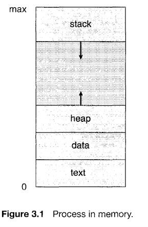
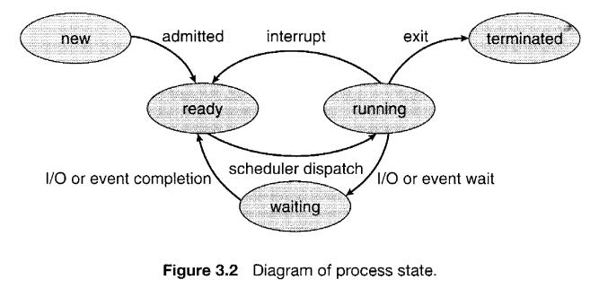
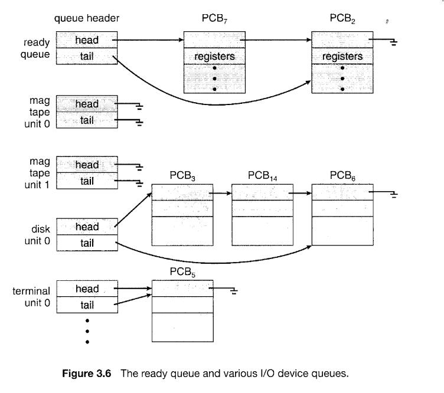
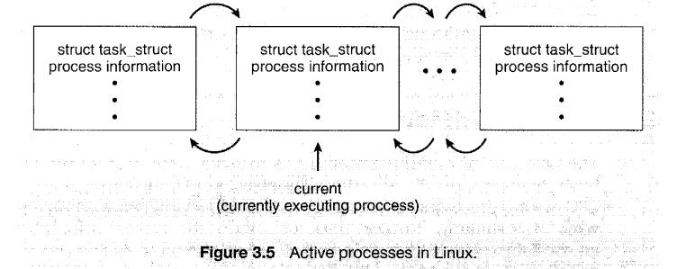
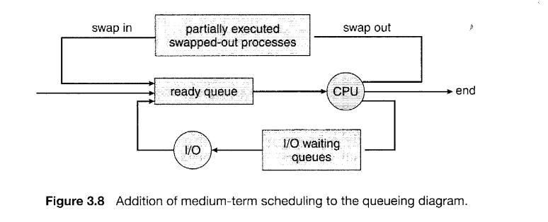
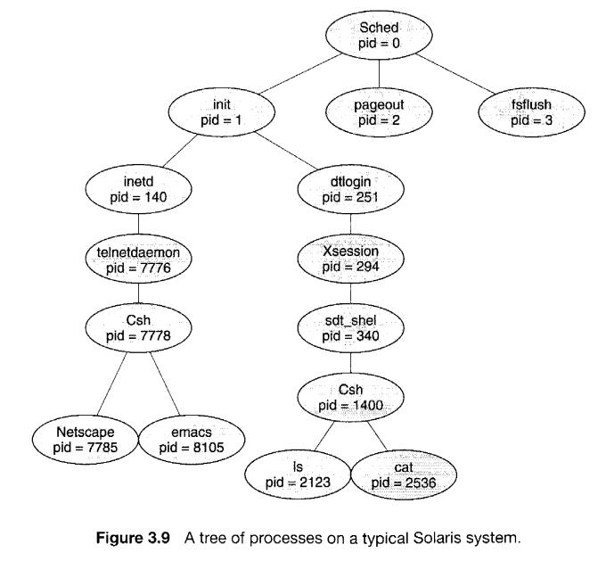
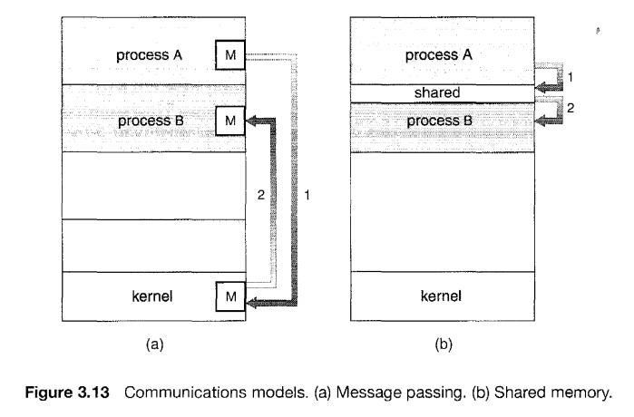

# Process

## The Process

A process is a program in execution.

* A program is a passive entity, such as a file containing a list of instructions stored on disk
* A process is an active entity, with a program counterspecifying the next instruction to execute and a set of associated resources
* A program becomes a process when an executable file is loaded into memory.
* Although two processes may be associated with the same program, they are nevertheless considered two separate execution sequences

A process includes:

* program code(text section)
* program counter
* contents of processor's register
* proess stack (temporary data : return value ,parameters)
* data section (global variables)
* heap ( the memory that is dynamically allocated during process run time0)



## Process State

As a process executes, it changes state.(五态模型)

* **New**. The process is being created.
* **Running**. Instructions are being excuted.
* **Waiting**. The process is waiting for some event to occur(such as an I/O completion or reception of a signal) (等待 I/O或者信号).
* **Ready**. The process is waiting to be assigned to a processor(by scheduler).
* **Terminated**. The process has finished execution.



It is important to realize that **only one process** can be **running** on any processor at any instant. **Many processes** may be **ready and waiting**, however. 

## Process Control Block

Each process is represented in the operating system by a process control block (PCB)-also called a task control block.

* **Process state**. The state may be new, ready, running, waiting, halted, and so on.
* **Program counter**. The counter indicates the address of the next instruction to be executed for this process.
* **CPU registers** . Along with the program counter, this state information must be saved when an  interrupt occurs, to allow the process to be continued correctly afterward.
* **Cpu-scheduling information.** This information includes a process priority, pointers to scheduling queues, and any other scheduling parameters.
* **Memory-management information.**
* **Accounting information**. This information includes the amount of CPU and real time used, time limits, account numbers, job or process numbers,and so on.
* **I/O status information.** This information includes the list of I/O devices allocated to the process, a list of open files, and so on.

(ps: Many modern operating systems have extended the process concept to allow a process to have multiple threads of execution and thus to perform more than one task at a time.)


## Process Scheduling

* The objective of **multiprogramming** is to have some process running at all times, to **maximize CPU utilization**. 
* The objective of **time sharing** is to **switch** the CPU among processes so **frequently** that users can **interact** with each program while it is running. 
* the **process scheduler** selects an **available** process (possibly from a set of several available processes) for program execution on the CPU. 

### Scheduling Queues

* **job queue** which consists of **all processes** in the system.(As a job enter the system they are put int a job queue).
* **ready queue** which consists of processes that are **residing in main memory** and are **ready** and **waiting** to execute. (implement as **linked list**, a ready-queue header contains pointers to the first and final **PCBs** in the list)
* **device queue** The list of processes waiting for a particular I/O device ( there are many processes in the system, the disk may be busy with the I/O request of some other process. ). Each device has its **own device queue**. 

#### During Process Running

1. The process could **issue an I/O request** and then be placed in an I/O queue. (I/O)
2. The process could create a new subprocess and **wait** for the subprocess's termination.(wait for some event to complete)
3. The process could be removed forcibly from the CPU, as a result of an **interrupt**, and be put back in the ready queue.

对于1，2来说进程从runing态转换到waiting态，等到事件（IO/其它事件）完成之后，从waiting 态转化为ready态
对于 3 ，由 中断打断（interrupted) ，从runing 态转化为 waiting态.

#### Process Representation in Linux

task struct:



### Schedulers 

* **Long-term scheduler(job scheduler)** selects processes from job pool and loads them into memory for excution.(more processes are submitted than can be executed immediately. These processes are spooled to a mass-storage device (typically a disk) called job pool)
* **short-term scheduler(CPU scheduler)** selects from among the processes that are ready to execute and allocates the CPU to one of them.

* **medium-term schedule(swapping)** he key idea behind a medium-term scheduler is that sometimes it can be advantageous to remove processes from memory (and from active contention for the CPU) and thus reduce the degree of multiprogramming. Later, the process can be reintroduced into memory, and its execution can be continued where it left off.


ps: 关于三种调度的个人理解.

* **长程调度** 这个调度主要是为了解决需要选择哪些进程读入内存（选择哪些进程被同时执行），因为计算机同时可以执行的进程数是有限的。通过长程调度我们可以控制计算机同时执行的进程数（多道的程度,degree of multiprogramming)，同时计算机的进程类型主要分为 I/O-bound process 和 CPU-bound process，在同时执行的进程中，一个好的 I/O进程和CPU进程的比例可以提升I/O设备和 CPU的效率（如果某一类进程过多，会导致另一种设备处于闲置状态）。长程调度可以很好地控制这两类进程的比例。长程调度主要出现在批处理系统中，很多现代操作系统不存在长程调度（比如linux)，长程调度的频率比较低。

* **中程调度** 这个调度也成为swaping，主要是选择将哪些进程中途移出主存（移入硬盘），和将哪些进程从硬盘移入主存，继续执行。中程调度和长程调度类似，但是本质上是不同的。两者的区别在于，长程调度是选择**哪些进程共同执行**（可以理解为被选择的进程原本还在进程池中没有被执行） 而中程调度则是选择将一个执行到一半（正在执行）的进程，调出主存（或者反过来将进程调入主存继续执行），中程调度的目的是为了，降低多道（multiprograming)的程度，减少进程对CPU的争夺，释放主存资源。（中程调度可能是因为主存资源不足，需要释放主存资源），其频率比长程调度高。

* **短程调度** CPU调度，就是从 ready queue中选择某些进程来执行（选择将CPU资源分配给ready queue中的某个进程），CPU调度的频率很高（可能每100毫秒就要执行一次）,因此CPU调度的选择时间会很大程度影响CPU性能。

* 三种调度的目的不同，最大的区别是执行频率：
短程调度>中程调度>长程调度。
执行时间的要求：
短程调度<中程调度<长程调度。

### Context Switch

When an interrupt occurs, the system needs to save the current context of the process currently running on the CPU so that it can restore that context when its processing is done, essentially suspending the process and then resuming it.

* we perform a **state save** of the current state of the CPU, be it in kernel or user mode.
* a **state restore** to resume operations.

**Context switch** When a context switch occurs, **the kernel** saves the context of the old process in its PCB and loads the saved context of the new process scheduled to run. Switching the CPU to another process requires performing a state save of the current process and a state restore of a different process. Context-switch time is pure overhead(因为啥都没做)

## Operations on Processes

### Process Creation

A process may create several new processes, via a create-process system calt during the course of execution. 

* The creating process is called a parent process
* The new processes are called the children of that process. 
* Each of these new processes may in turn create other processes, forming a tree of processes



* **pid** Most operating systems (including UNIX and the Windows family of operating systems) identify processes according to a unique **process identifier**.

* In general, a process will need **certain resources** (CPU time, memory, files, 1/0 devices) to accomplish its task. (进程是资源分配的基本单位)
* Resources of subprocess. **first way** obtain its resources directly from the operating system. **second way** it may be constrained to a subset of the resources of the parent process.(the parent can **partition** or **share** its resources)

some important functions in Linux (can check man pages for detail):
* fork()
* exec() (execlp()\execve())
* wait()

windows version:
* CreateProcess().
* WaitForSingleObject().

### Process Termination

some important functions:

* exit() () (the process may return a status value (typically an integer) to its parent process (via the waitO system call). )

Termination  ways:

1. Normaly terminate(by exit() fuction ),A process terminates when it finishes executing its final statement and asks the operating system to delete it by using the exit () system call.
2. A process can cause the termination of another process via an appropriate system call (for example, TerminateProcess () in Win32). (such a system call can be invoked only by the parent of the process that is to be terminated)

**cascading termination** Some systems, including VMS, do not allow a child to exist if its parent has terminated. In such systems, if a process terminates (either normally or abnormally), then all its children must also be terminated.
(注意 在Linux中当一个进程结束之后，它的子进程会将init进程作为它们的父进程，而不是被消灭)

## Interprocess Communication

A process is **cooperating** if it can affect or be affected by the other processes executing in the system. 

reasons for cooperating:

* **Information sharing.** Since several users may be interested in the same piece of information (for instance, a shared file), we must provide an environment to allow concurrent access to such information.
* **Computation speedup.** If we want a particular task to run faster, we mustbreak it into subtasks, each of which will be executing in parallel with the others. Notice that such a speedup can be achieved only if the computer has multiple processing elements (such as epus or I/O channels).
* **Modularity.** We may want to construct the system in a modular fashion, dividing the system functions into separate processes or threads
* **Convenience.** Even an individual user may work on many tasks at the same time. For instance, a user may be editing, printing, and compiling in parallel.

Cooperating processes require an **interprocess communication (IPc) mechanism** that will allow them to exchange data and information. 

two fundamental models of ICP:

* **shared memory** allows maximum speed and convenience, faster than message passing(system calls are required only to establish shared-memory regions)
* **message passing** small amounts of data, no conflics need be avoided, easier to implememt.



### Shared-Memory Systems

```c++
void Swap(boolean *a , boolean *b){
    boolean temp = *a;
    *a = *b;
    *b = temp;
}

// 解决无限等待问题，使用队列
int wait[n] =0; // 等待队列 
bool look;
do{
    bool key = true;
    wait[i] = 1;     // 当前需要等待
    while(key==true && wait[i] ==1) Swap(&lock,&key)
    
    //  critical section
    j = (i+1) % n ;
    while( j !=i && wait[i] !=1 ) j = (j+1)%n;
    if(j==i) lock = False;
    else wait[j]=0;
    // remainder section
}while(true)

```

```c++

// 方案 1
class Server{
    count = new Semephore(n); // 计数型信号量 
}

Server::create_connection{
    // 创建连接
    count->P(); // P操作 或者写为 wait(count)
    create_new_connection() ; // 创建新的连接
}

Server::release_connection{
    // 断开连接
    release_one_connection();
    count->V(); // V 操作 或者写为 signal(count)

}
// 方案1 可能导致进程卡在 P操作里 换一种写法

Class Server{
    mutex = new Semephore(1); // 互斥变量用来保护对conut的访问
    int count =n;
}
 Server::create_connection{
    mutex->P(); // 访问 count
    // 临界区
    if(count>0){
        create_new_connection();
        count--;
    }
    mutex->V();    // 访问 count 完后曾
    
}

Server::release_connection{
     mutex->P()；
    release_one_connection();
    count++;
     mutex->V()；

}

wait(semaphore *S){
    S->value--;
    if(S->value<0){
        add this process to S->list;
        block();
    }
}

signal(semaphore *S){
    S->value++;
    if(S->value <=0){
        remove a process P from S->list;
        wakeup(P);
    }
}
```

```c++
// 阅览室问题

class Room{
    mutex = new Semephore(1);  // 控制对 seat变量的访问
    seat =n ;  //空位
}

Room::get_in(){
    mutex->P();
    if(seat>0){
        //判断当前是否有座位
        seat--;
        login();   //登记
        reading();
    }
    // 如果没座位就直接退出去了
    mutex->V();
}

Room::get_out(){
    mutex->P()
    seat++;
    logout(); // 注销
    mutex->V();
}

class BarberRoom{
    chairs   = n ;            //椅子数, 因为要实现没有椅子离开，所以不能用信号量
    mutex = new Semaphore() ; // 控制对 chairs的访问
    customers = new Semaphore(0) ;  // 顾客信号量，一开始没有顾客
    barber = new Semaphore(1) ;  // 理发师信号量
   
}

BarberRoom::barber_room{
    //理发室

    // 如果有顾客
    customers->P();
    barbering()   //理发
    barber->V() ;  //通知新的顾客可以来理发了
}

BarberRoom::waiting_room{
    //等候室
    mutex->P();
    if(chairs>0){
        chairs--;
        customers->V();  // 顾客增加,同时如果此时理发师在睡觉，会唤醒理发师
        mutex->V();
        barber->P();    //排队理发
        
        // 起身去理发，把椅子空出来
        mutex->P();
        charirs++;
        mutex->V();
    }else{
        get_out();
        mutex->V();
    }
}


```